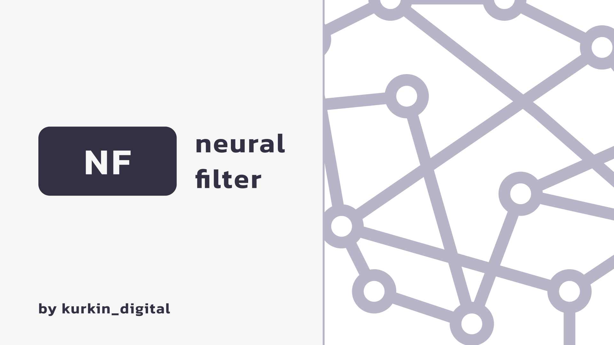
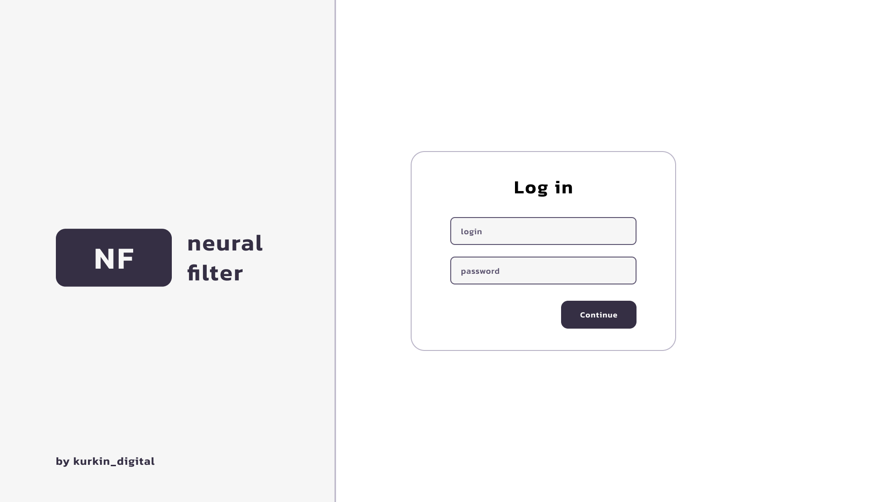
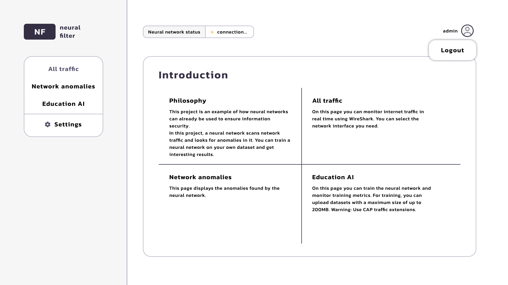
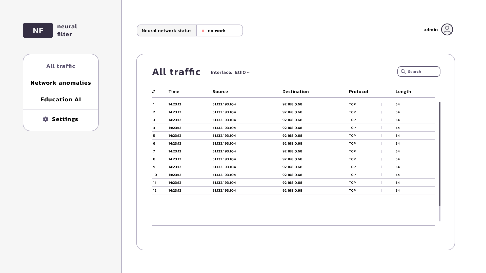
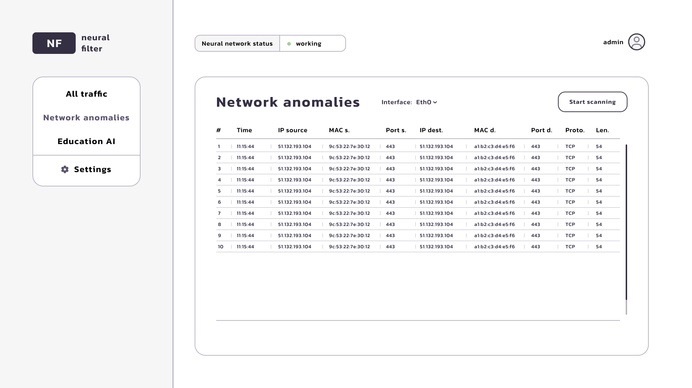
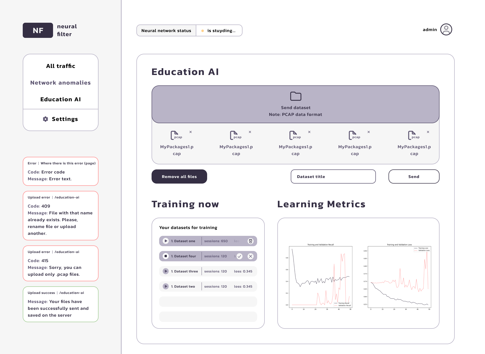
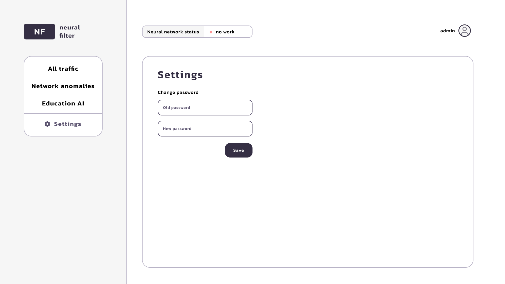

## Introduce

This is the _frontend_ and _backend_ part of the diploma project **neural-filter**. This project demonstrates how neural networks can be applied to ensure information security. In this project, a neural network scans network traffic and looks for anomalies. You can train a neural network on your own dataset and achieve interesting results.

You can get more details in the [`diploma`](https://disk.yandex.ru/i/GaerzbprvIXZhw).

## 📉 Why This Project Doesn’t Make Much Sense in Most Cases

### Intro

Before describing the problems of this project, we need to define its main goal and what it aims to solve. The primary purpose of this project is analyzing network traffic — not just classifying or filtering it.

But what does "analyze" mean? Analysis is the process of examining something, especially by breaking it into parts, in order to understand what it is or what it contains. So, the solution must divide traffic into sessions and process each session individually. The model should identify anomalies within a session by examining both **individual packet features** and the **overall context** of the session.

### Why Not Use RNN / CNN?

Based on the nature of the task, it's clear that architectures like RNNs, CNNs, or MLPs are not well-suited. These models excel at classification, but not at deep contextual understanding or reasoning. They struggle to capture long-term dependencies and patterns in the data at the session level.

I experimented with RNN and CNN architectures and ended up with classification models — which defeats the purpose. If all you need is classification or simple filtering, you might as well use existing non-AI tools such as Snort, Suricata, Zeek, or even Wireshark. These tools are well-optimized and widely adopted for rule-based traffic inspection and filtering.

For instance, a network administrator can perform deep traffic analysis using Wireshark alone. A system administrator with 15+ years of experience once told me that manual inspection is often more reliable than automated tools — if you know what you're looking for.

So, building a classifier just for the sake of using ML seems pointless in this context.

### Transformers - the best architecture for this task

When I discovered transformers, I realized they’re the most suitable architecture for traffic analysis. Unlike traditional models, transformers can understand context, model relationships between tokens (packets), and retain useful information across long sequences.

I built a transformer from scratch with reconstruction **loss + thresholding** as a method to detect anomalies.

- The input has the shape `(sessions, packets, 8 packet features)`
- An `nn.Linear` embedding layer maps each 8D packet into a `d_model`-dimensional space, giving shape `(sessions, packets, d_model)`
- Then I apply *positional encoding*
- The transformer encoder stack processes this representation and outputs data with the same shape
- Finally, I calculate the *MSE loss* between the original and reconstructed input. A high MSE indicates an **anomalous session or packet**, while a low loss means normal traffic

This setup allows the model to detect behavior that doesn’t conform to learned patterns — a suitable strategy for unsupervised anomaly detection.

### Problems and thoughts

The main challenge is the computational cost of this solution. Transformers are memory-hungry, especially with long sequences and high-dimensional embeddings.

Another issue is that training the transformer has been difficult. That's mostly on me — I’m still learning the details of attention mechanisms, training stability, weight initialization, etc. But I’m improving daily and committed to solving these issues step by step.

### 🔋 Resource Estimate: Training a Transformer on `(256, 2048, 8)`

With input shape `(256 sessions, 2048 packets, 8 features)` and `d_model = 128`, the model processes **around 67 million tokens per batch** (`256 × 2048`). Each attention layer in a transformer has O(seq_len²) complexity per head — so:

- For **2048 sequence length, self-attention** alone requires:
  - `O(2048² × d_model × num_heads)` operations
  - That’s ~0.5 billion operations per layer per batch
  - With 12 layers and 8 heads, total compute per forward pass is in the several teraflops range

**Estimated GPU memory required**:
~10–16 GB for forward/backward pass with:

- `d_model = 128`
- `num_layers = 12`
- `num_heads = 8`
- optimizer state, gradients, attention maps, activations

💸 **Training cost**:

- On an RTX 5090 (~32 GB VRAM): 1–2 samples/sec, taking days to converge
- On a cloud GPU like A100 (hourly rate ~$1.5–$3): several hundred dollars to train from scratch on real traffic data
- Real-world datasets (millions of sessions) would push it into thousands of dollars and multi-week training
- 👉 Conclusion: this architecture is feasible, but expensive without optimization — hence Lightweight variants like Performer, Linformer, Longformer or chunked attention are worth considering early on.

### Links

- [Frontend part]()
- [Backend part]()
- [Behance case](https://www.behance.net/gallery/201619595/Neural-Filter)
- [The written part of the diploma](https://disk.yandex.ru/i/GaerzbprvIXZhw)



## Technologies

### Frontend

The **frontend part** of the application was developed using:

- [Next.JS v14](https://nextjs.org/) + [TypeScript](https://www.typescriptlang.org/)
- [Axios](https://axios-http.com/docs/intro)
- [Redux-Toolkit](https://redux-toolkit.js.org/)
- [React-Dropzone](https://react-dropzone.js.org/)
- [Motion](https://motion.dev/docs)

### Backend

The **backend part** of the application was developed using:

- [Django v.4.2](https://docs.djangoproject.com/en/4.2/)
- [Tensorflow v.2.16.1](https://www.tensorflow.org/)
- [Numpy v.1.26.4](https://numpy.org/)
- [Pandas v.2.2.1](https://pandas.pydata.org/)
- [Scikit-learn v.1.4.1](https://scikit-learn.org/stable/)
- [Matplotlib v.3.8.3](https://matplotlib.org/)
- [Keras v.3.2.1](https://keras.io/)
- [Psycopg v.3.1.18](https://www.psycopg.org/)
- [PyJWT v.2.8.0](https://pyjwt.readthedocs.io/en/stable/)
- [PostgreSQL:latest in the Docker](https://hub.docker.com/_/postgres)

**Note:** The backend part works **only on Linux**. There's no adaptation for Windows systems.

## Getting Started

### Frontend

After cloning the project from GitHub, install the necessary packages:

```bash
npm i
npm audit fix # you might need to run this after installing
```

Build the application:

```bash
npm run build
# or
yarn build
# or
pnpm build
# or
bun build
```

Start the application:

```bash
npm run start
# or
yarn start
# or
pnpm start
# or
bun start
```

Open [http://localhost:3020](http://localhost:3020) in your browser to view the application. **Make sure that the backend part has already been started**. The app cannot function without the backend.

### Backend

First, create a Python virtual environment and activate it:

```bash
python3 -m venv venv
source venv/bin/activate
```

Then, install all the required packages from the `requirements.txt` file:

```bash
pip install -r requirements.txt
```

Configure the `.env` file in the root directory (above the frontend and backend folders) with PostgreSQL authentication settings:

```.env
POSTGRES_SERVER=localhost
POSTGRES_PORT=5432
POSTGRES_USER=postgres_user
POSTGRES_PASSWORD=postgres_password
POSTGRES_DB=postgres_db
```

Also, set the following lines to create a **superuser**:

```.env
SUPERUSER_NAME=admin
SUPERUSER_EMAIL=admin@gmail.com
SUPERUSER_PASSWORD=admin_password
```

You can modify the `docker-compose.yml` file according to your needs.

Run the project with the command:

```bash
python manage.py runserver 8080
```

The application will be available at [http://localhost:8080](http://localhost:8080).

## Application Pages

### 1. Authorization

The user must log in first. There is no registration page, so accounts must be pre-created when starting the _backend part_. Authorization is handled via a _JWT_ token. The user receives a refresh token, which the server verifies.



### 2. Main Page

This introduction page provides key information about the application.



### 3. All Traffic

This page allows users to monitor internet traffic in real time using WireShark. The user can select the desired network interface.
This page works via WebSocket. The server scans network traffic with Scapy and sends each network packet to the client.



### 4. Network Anomalies

This page displays anomalies detected by the neural network. If no anomalies are found, a success status is shown.
The neural network operates on this page. Users can scan the current network interface only after starting the neural network at [http://localhost:8080/education-ai](http://localhost:8080/education-ai).



### 5. Education AI

On this page, users can train the neural network and monitor training metrics. Datasets with a maximum size of 1GB can be uploaded for training.
**Warning:** Use only `.pcap` traffic files.
The uploaded `.pcap` files are processed, generating a dataset for neural network model training. Up to 7 datasets can be used, but only one neural network model is employed.
The neural network's operation status is displayed in a dedicated block. The client and server communicate via WebSocket, enabling real-time monitoring of both the operation status and server connection.



### 6. Settings

This page allows users to change their password.


