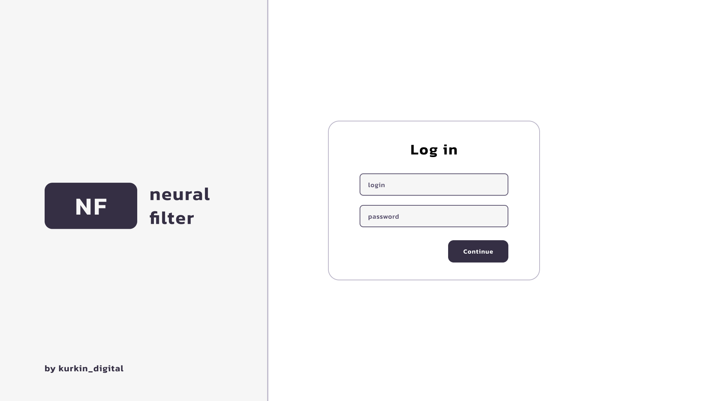
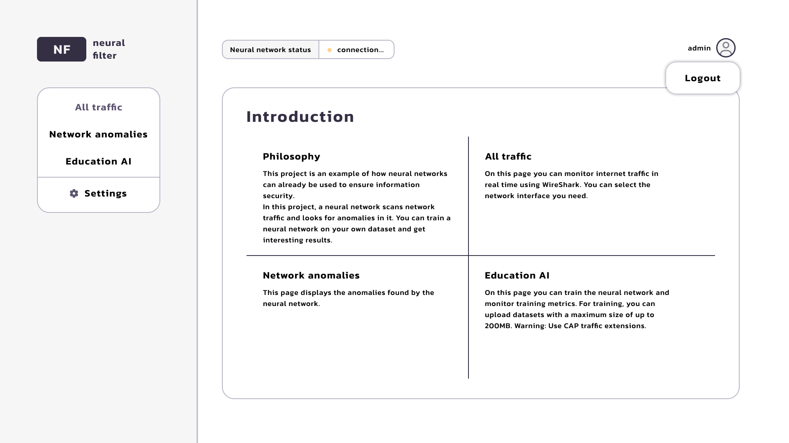
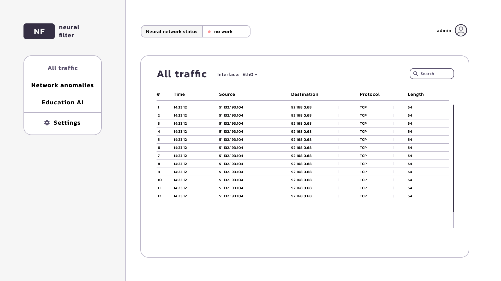
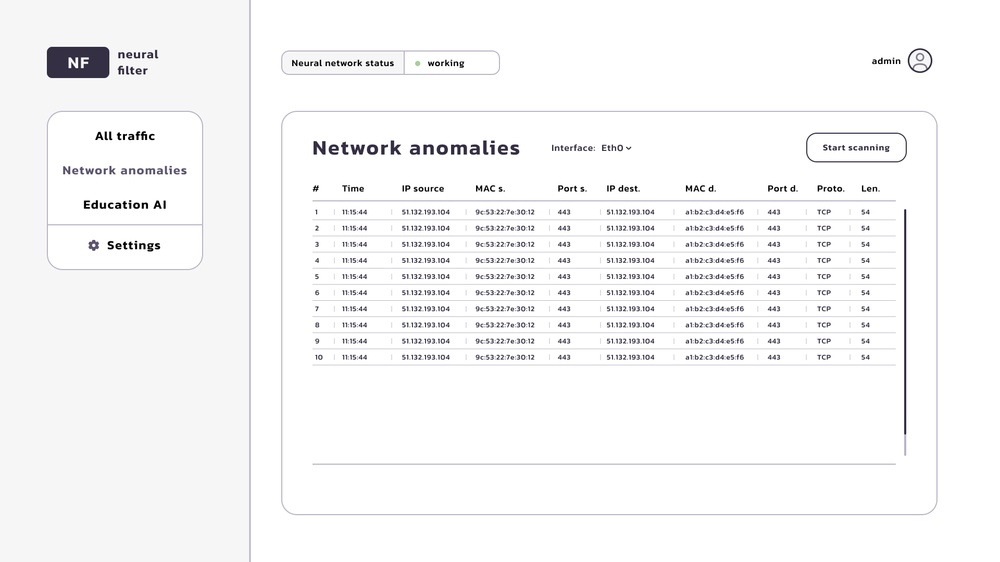
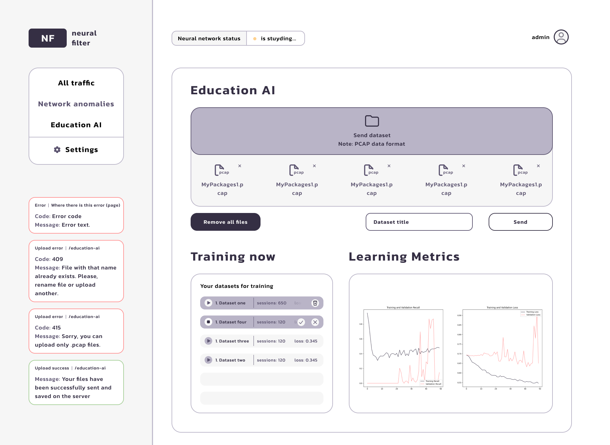
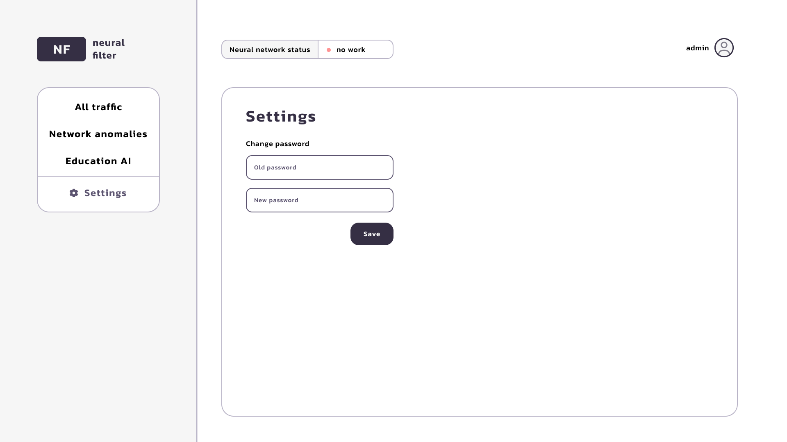

## Introduce

This is the *frontend* part of the diploma project **neural-filter**. This project is an example of how neural networks can already be used to ensure information security.\nIn this project, a neural network scans network traffic and looks for anomalies in it. You can train a neural network on your own dataset and get interesting results.

### Links
- [Backend part](https://github.com/timofeiKurkin/neural-filter-backend)
- [Behance case](https://www.behance.net/gallery/201619595/Neural-Filter)
- [The written part of the diploma](https://disk.yandex.ru/i/GaerzbprvIXZhw)


## Technologies

**Frontend part** of the application was developed with:
- [Next.JS v14](https://nextjs.org/) + [TypeScript](https://www.typescriptlang.org/)
- [Axios](https://axios-http.com/docs/intro)
- [Redux-Toolkit](https://redux-toolkit.js.org/)
- [React-Dropzone](https://react-dropzone.js.org/)
- [Motion](https://motion.dev/docs)

## Getting Started

After getting project from GitHub, install packages:

```bash
npm i
npm audit fix # maybe after installing you must to run this
```

Then, run the building of the application:

```bash
npm run build
# or
yarn build
# or
pnpm build
# or
bun build
```

After building start the project:

```bash
npm run start
# or
yarn start
# or
pnpm start
# or
bun start
```

Open [http://localhost:3020](http://localhost:3020) with your browser to see the application. **Make sure that the backend part of the app has already been started**. You can't use app without the backend part.

## Application pages

### 1. Authorization
First of all, user have to *authorization*. There is no registration page, so your account should have already created when user started *backend part*.
Authorization in the app works via *JWT* token. User saves refresh token and server part verify it.



### 2. Main Page
This is an introduce page where user can get main info about the application.



### 3. All traffic
On this page user can monitor internet traffic in real time using WireShark. You can select the network interface user need.
This pages works via WebSocket. Server part are scanning network traffic with scapy and the send each network packet to the client.



### 4. Network anomalies
This page displays the anomalies found by the neural network. If anomalies were not found will be success status.
Neural network is working on this page. User can run scanning current network interface only after running neural network on the [http://localhost:8080/education-ai](http://localhost:8080/education-ai)



### 5. Education AI
On this page user can train the neural network and monitor training metrics. For training, user can upload datasets with a maximum size of up to 1GB.  
Warning: Use only .pcap traffic extensions.
The .pcap files received from the client are processed, and a dataset is generated for training the neural network model. There can be multiple datasets (up to 7), but only one neural network model is used
The status of the neural network's operation is displayed in a dedicated block. The connection between the client and server parts is established via WebSocket, allowing not only the operation status to be monitored but also the connection to the server.



### 6. Settings
Here user can change his password.


