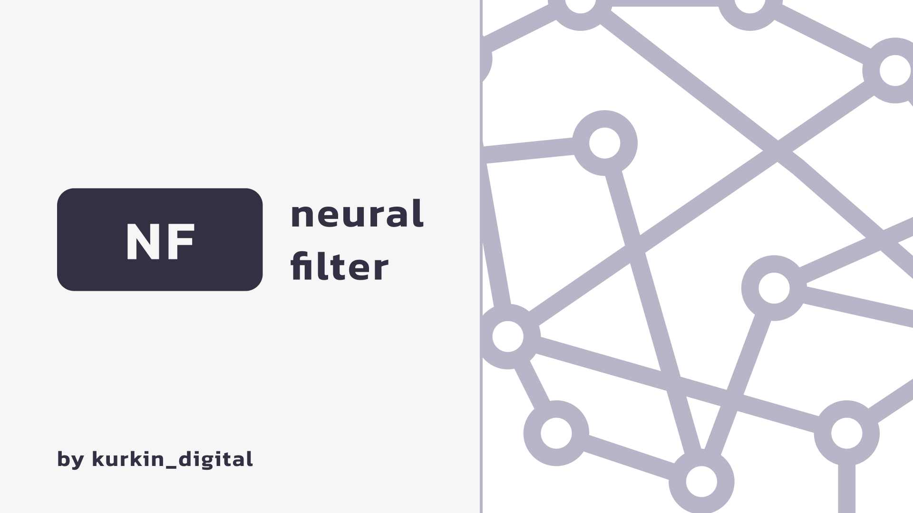

## Introduce

This is the *backend* part of the diploma project **neural-filter**. This project is an example of how neural networks can already be used to ensure information security.\nIn this project, a neural network scans network traffic and looks for anomalies in it. You can train a neural network on your own dataset and get interesting results. You can get more info in the [`diploma`](https://disk.yandex.ru/i/GaerzbprvIXZhw).

### Links
- [Frontend part]()
- [Behance case](https://www.behance.net/gallery/201619595/Neural-Filter)
- [The written part of the diploma](https://disk.yandex.ru/i/GaerzbprvIXZhw)




## Technologies

**Frontend part** of the application was developed with:
- [Django v.4.2](https://docs.djangoproject.com/en/4.2/)
- [Tensorflow v.2.16.1](https://www.tensorflow.org/)
- [Numpy v.1.26.4](https://numpy.org/)
- [Pandas v.2.2.1](https://pandas.pydata.org/)
- [Scikit-learn v.1.4.1](https://scikit-learn.org/stable/)
- [Matplotlib v.3.8.3](https://matplotlib.org/)
- [Keras v.3.2.1](https://keras.io/)
- [Psycopg v.3.1.18](https://www.psycopg.org/)
- [PyJWT v.2.8.0](https://pyjwt.readthedocs.io/en/stable/)
- [PostgreSQL:latest in the Docker](https://hub.docker.com/_/postgres)

This backend part can work **only on linux**. There's no adaptive for windows systems, sorry.

## Getting Started

First of all, create python virtual environment and activate it:
```bash
python3 -m venv venv
source venv/bin/activate
```

Then install all packages from `requirements.txt` file:
```bash
pip install -r requirements.txt
```

You should adjust `.env` file in root directory, that is above frontend and backend folders, and adjust `postgres auth settings` for container:

```.env
POSTGRES_SERVER=localhost
POSTGRES_PORT=5432
POSTGRES_USER=postgres_user
POSTGRES_PASSWORD=postgres_password
POSTGRES_DB=postgres_db
```

Also adjust below lines to create **super user**:
```.env
SUPERUSER_NAME=admin
SUPERUSER_EMAIL=admin@gmail.rom
SUPERUSER_PASSWORD=admin_password
SUPERUSER_PASSWORD=admin_password
```

Also you can adjust `docker-compose.yml` file according to your needs.

Run project via command:
```bash
python manage.py runserver 8080
```
You can find your application on [http://localhost:8080](http://localhost:8080)
